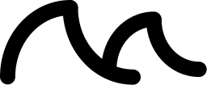
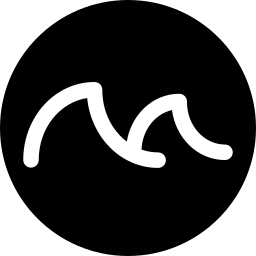
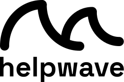
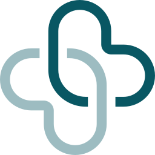
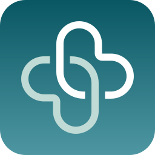
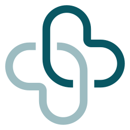

# Brand

Vector-first brand kits for **helpwave** and **App zum Doc**.

| Format | Layout | Rule |
|--------|--------|------|
| **SVG** | `*/svg/` | Minimal cutouts — viewBox tightly around the artwork |
| **PNG** | `*/png/<size>/` | Square for icons/circles; **natural aspect** for marks & banners (`size` = longer side) |
| **ICO** | `*/ico/` | Multi-resolution favicon (`16–256`) for **square** assets only |

```bash
./scripts/check-brand-svgs.sh
./scripts/export-brand-assets.sh
```

Prefer `rsvg-convert` (librsvg) plus ImageMagick so local exports match GitHub Actions. Actions uses Ubuntu apt packages (`librsvg2-bin`, `imagemagick` → `convert`). Locally, either `magick` (ImageMagick 7) or `convert` works; for byte-identical commits, regenerate with the same Ubuntu stack Actions uses. Override sizes with:

```bash
PNG_SIZES="32 128 1024" ICO_SIZES="16 32 48" ./scripts/export-brand-assets.sh
```

## PNG sizes

| Size | Common use |
|------|------------|
| 16, 32, 48 | Favicons, browser UI |
| 64, 128 | Toolbars, small tiles |
| 180 | Apple touch icon |
| 192, 512 | Android / PWA icons |
| 256 | Windows tiles, denser favicons |
| 1024 | Default high-res download |

For natural assets (e.g. `banner-horizontal`), `1024` means the longer edge is 1024px — not a square canvas.

## helpwave logo variants

| Variant | File stem | Use |
|---------|-----------|-----|
| Transparent (black mark) | `mark` | Over light / photo backgrounds |
| Transparent (white mark) | `mark-white` | Over dark / photo backgrounds |
| On white | `mark-on-white` | Opaque white plate |
| Inverted on black | `mark-on-black` | Opaque black plate, white mark |

Same naming applies to `banner` and `banner-horizontal`.

Example: [`helpwave/png/1024/mark.png`](helpwave/png/1024/mark.png) · [`helpwave/png/1024/mark-on-white.png`](helpwave/png/1024/mark-on-white.png) · [`helpwave/ico/circle.ico`](helpwave/ico/circle.ico)

## Trademark & license

Repository source code and documentation are under the [Mozilla Public License 2.0](../LICENSE).

**The MPL does not grant rights to trademarks.** The helpwave name, wave mark, App zum Doc name and marks, and related logos remain trademarks of helpwave GmbH. You may use these assets to refer to helpwave products accurately (for example in press coverage or integrations). Do not imply endorsement, alter the marks in misleading ways, or use them as your own brand without written permission. Contact [contact@helpwave.de](mailto:contact@helpwave.de) for brand questions.

## Colors

### helpwave

| Token | Value | Use |
|-------|-------|-----|
| Ink | `#000000` | Default mark & wordmark on light backgrounds |
| Paper | `#FFFFFF` | Inverse mark on dark backgrounds |

### App zum Doc

| Token | Value | Use |
|-------|-------|-----|
| Teal | `#095763` | Primary fill |
| Mist | `#9DBCC1` | Secondary fill |
| Soft | `#C0DBD6` | Icon highlight / on-dark secondary |
| Gradient | `#095763` → `#4E97A2` | App icon background |

## helpwave gallery

| Asset | SVG | PNG (1024) | ICO |
|-------|-----|------------|-----|
| Mark (transparent) | [`svg/mark.svg`](helpwave/svg/mark.svg) | [`png/1024/mark.png`](helpwave/png/1024/mark.png) | — (natural) |
| Mark white | [`svg/mark-white.svg`](helpwave/svg/mark-white.svg) | [`png/1024/mark-white.png`](helpwave/png/1024/mark-white.png) | — |
| Mark on white | [`svg/mark-on-white.svg`](helpwave/svg/mark-on-white.svg) | [`png/1024/mark-on-white.png`](helpwave/png/1024/mark-on-white.png) | — |
| Mark on black (inverted) | [`svg/mark-on-black.svg`](helpwave/svg/mark-on-black.svg) | [`png/1024/mark-on-black.png`](helpwave/png/1024/mark-on-black.png) | — |
| Circle | [`svg/circle.svg`](helpwave/svg/circle.svg) | [`png/1024/circle.png`](helpwave/png/1024/circle.png) | [`ico/circle.ico`](helpwave/ico/circle.ico) |
| Banner | [`svg/banner.svg`](helpwave/svg/banner.svg) | [`png/1024/banner.png`](helpwave/png/1024/banner.png) | — |
| Banner horizontal | [`svg/banner-horizontal.svg`](helpwave/svg/banner-horizontal.svg) | [`png/1024/banner-horizontal.png`](helpwave/png/1024/banner-horizontal.png) | — |

<p>
  
  &nbsp;
  
  &nbsp;
  
  &nbsp;
  
</p>

## App zum Doc gallery

| Asset | SVG | PNG (1024) | ICO |
|-------|-----|------------|-----|
| Logo color | [`svg/logo-color.svg`](app-zum-doc/svg/logo-color.svg) | [`png/1024/logo-color.png`](app-zum-doc/png/1024/logo-color.png) | [`ico/logo-color.ico`](app-zum-doc/ico/logo-color.ico) |
| Logo on white | [`svg/logo-on-white.svg`](app-zum-doc/svg/logo-on-white.svg) | [`png/1024/logo-on-white.png`](app-zum-doc/png/1024/logo-on-white.png) | [`ico/logo-on-white.ico`](app-zum-doc/ico/logo-on-white.ico) |
| Logo on black | [`svg/logo-on-black.svg`](app-zum-doc/svg/logo-on-black.svg) | [`png/1024/logo-on-black.png`](app-zum-doc/png/1024/logo-on-black.png) | [`ico/logo-on-black.ico`](app-zum-doc/ico/logo-on-black.ico) |
| App icon | [`svg/icon.svg`](app-zum-doc/svg/icon.svg) | [`png/1024/icon.png`](app-zum-doc/png/1024/icon.png) | [`ico/icon.ico`](app-zum-doc/ico/icon.ico) |
| Circle variants | `svg/circle-*.svg` | `png/1024/circle-*.png` | `ico/circle-*.ico` |

<p>
  
  &nbsp;
  
  &nbsp;
  
</p>

## Raw GitHub URLs

```text
https://raw.githubusercontent.com/helpwave/helpwave/main/brand/helpwave/svg/mark.svg
https://raw.githubusercontent.com/helpwave/helpwave/main/brand/helpwave/png/1024/mark.png
https://raw.githubusercontent.com/helpwave/helpwave/main/brand/helpwave/png/1024/mark-on-white.png
https://raw.githubusercontent.com/helpwave/helpwave/main/brand/helpwave/ico/circle.ico
```

CI uploads a downloadable **brand-kit** artifact from the export workflow on each verified run.
