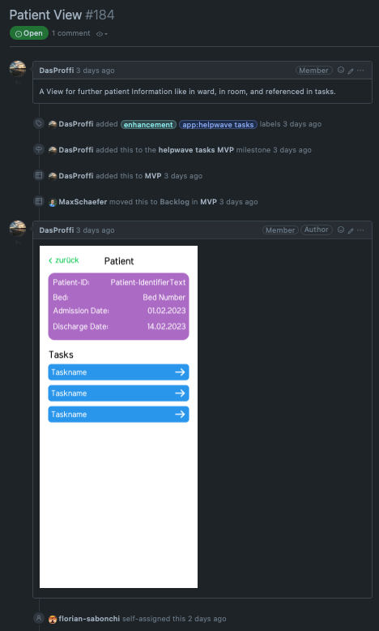

# The helpwave development workflow

We developed a workflow to streamline the product development.
The goal of this workflow is to combine out internal resources of the helpwave organization with the developers of the open-source community.

The workflow tries to reduce a feature of a product down to an issue for a developer.
The helpwave community, customers or any kind of entity can request a feature or starts discuss
of an idea in the [discussion-tab](https://github.com/helpwave/helpwave/discussions) of the helpwave/helpwave repository.

A feature is a written specification that is written from the user's point of view.
This specification should not contain any implementation details and can span across multiple projects.
Out of the discussions and ideas, one of the product owners creates this [feature-issue](https://github.com/helpwave/helpwave/issues?q=is%3Aissue+is%3Aopen+label%3Afeature+) in the helpwave/helpwave repository.

When a new feature got created, the community can give feedback and discuss implementation details.
After the definition-of-ready is reached and every unclarity was addressed,
the maintainers break down the feature-issue into smaller implementation detail focused issues in their repositories of concern.
The maintainers have the overall view of their repositories and act as a kind of codeowner to them.
They create issues out of feature-issues, provide support for new developers and keeps the code on track.

Every developer can now assign themselves to an issue and work towards the definition-of-done.
If the issue modifies or defines an architectural foundation, the developer must write an [ADR](http://adr.github.io) to keep track of the decision process.
When reached, a maintainer does quality-assurance against the feature-issue definition-of-done.

## Approach the workflow as ...

### ... a maintainer

- Be an active part of the helpwave community
- Join the slack, talk to other maintainers
- Provide value and support to the developers
- Take an eye on the issues and keep track of the overview

### ... a developer

- Take a look at the repositories for open issues
- Self-Assign your issue of choice
- Develop towards a solution

## Example

A product owner defines a feature-issue out of a meeting in the slack. The issue contains all necessary information
to take conscious decision for the implementation.

A maintainer of the mobile-app repository looks into the issue and sees how he and his repository can participate in the completion of the feature.
The maintainer then creates an issue with implementation details.

A developer now, self-assigns the issue and works towards the completion.

---

- [Wiki](https://wiki.helpwave.de/s/c1724884-5c8c-4573-bf13-78efeb0c946b)
