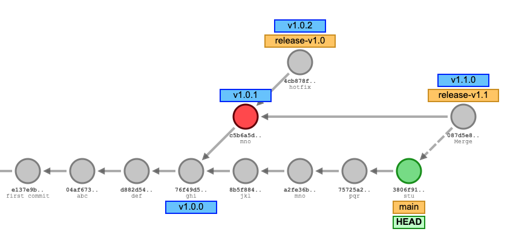

# **ADR-009: Versioning strategy**

## Status

Proposed

## Context

As a software product, we should establish a sense of versioning.
With versioning we are able to pin our products as a versioned resource at customer facing deployments
or for feature planing. This ADR is focused on the Git implementation of our versioning strategy.

## Decision

The base of every versioning strategy is the version number. We are using [Semantic Versioning 2.0.0](https://semver.org/) with version prefix of `v`.
Our Git strategy is based on the branching and versioning strategy of [Dapr](https://github.com/dapr/dapr).

- New changes are comitted to the `main` branch.
- For every `MINOR` release, we create a new branch `release-v[MAJOR].[MINOR]` (_release branch_) based on the previous release on the same `MAJOR` track.
- New changes for the release branch are either merged or cherry-picked from `main`.
- The version of the software on a release branch, until tagged, is called pre-release.
- When ready to ship, the latest commit on a release branch is tagged `v[MAJOR].[MINOR].[PATCH]` based on the version number.
- A tag of a commit on the release branch indicates a released version.
- If a Bugfix needs to take place for all versions, the fix can be made against the `main` branch and cherry-picked into the release branches.
- If a change needs to be made only for a specific version, it can be made on the release branch 

## Consequences

As long as our versioning strategy stays consistent across our whole product landscape.
The major version is a compatibility identifier. `web/tasks/v1.1.1` is compatible with `services/v1.2.3`, as `MINOR` versions add functionality in a backward compatible manner.
